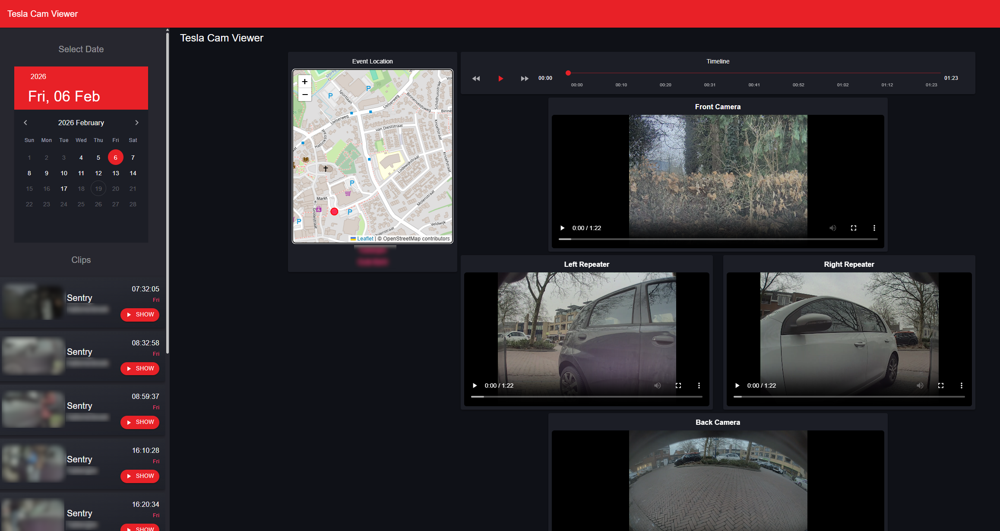

# TeslaCamViewer

TeslaCamViewer is a web-based application which uses [Tesla USB](https://github.com/marcone/teslausb) to view the collected clips easily in a web based page.  
It uses a postgres database for event meta data and uses [MINIO](https://www.min.io/) for clip storage.

The clips as written by a tesla are split per minute per camera. This application stitches them together and stores them in [MINIO](https://www.min.io/)

You can select a date in the calender, and it will automatically list the clips for that particular date.




# Deployment Steps

1. **Docker compose**

   Use the following docker compose file.  
   Change the `TeslaCam__SentryClipsPath` and `TeslaCam__SavedClipsPath` variables to reflect the location of where the clips from tesla usb are send to.

   ```yaml
   services:
    app:
        image: thijswm/tesla-cam-viewer:latest
        depends_on:
        db:
            condition: service_healthy
        minio:
            condition: service_healthy
        environment:
        - ASPNETCORE_URLS=http://0.0.0.0:8080
        - TZ=UTC
        - ConnectionStrings__Default=Host=db;Port=5432;Database=tesla_cam;Username=tesla;Password=tesla
        - TeslaCam__SentryClipsPath=/tesla_usb/SentryClips
        - TeslaCam__SavedClipsPath=/tesla_usb/SavedClips
        ports:
        - "8080:8080"
    db:
        image: postgres:16-alpine
        environment:
        POSTGRES_USER: tesla
        POSTGRES_PASSWORD: tesla
        POSTGRES_DB: tesla_cam
        volumes:
        - db_data:/var/lib/postgresql/data
        ports:
        - "5432:5432"
        healthcheck:
        test: [ "CMD-SHELL", "pg_isready -U tesla -d tesla_cam" ]
        interval: 10s
        timeout: 5s
        retries: 5
        start_period: 10s
    minio:
        image: minio/minio:latest
        command: server /data --console-address ":9001"
        restart: unless-stopped
        environment:
        MINIO_ROOT_USER: minio
        MINIO_ROOT_PASSWORD: minio123
        volumes:
        - minio_data:/data
        healthcheck:
        test: ["CMD", "curl", "-f", "http://localhost:9000/minio/health/live"]
        interval: 30s
        timeout: 10s
        retries: 5
        start_period: 30s
    minio-init:
        image: minio/mc:latest
        depends_on:
        - minio
        entrypoint: >
            /bin/sh -c " set -e; rm -rf /root/.mc; echo 'Waiting for MinIO...'; until mc alias set myminio http://minio:9000 $${MINIO_ROOT_USER} $${MINIO_ROOT_PASSWORD}; do
                echo 'MinIO not ready or creds wrong, retrying...';
                sleep 2;
            done; mc mb -p myminio/tesla-cam || true; mc anonymous set none myminio/tesla-cam; mc ls myminio; echo 'Done.'; "
        environment:
            MINIO_ROOT_USER: minio
            MINIO_ROOT_PASSWORD: minio123
        restart: "no"    
    volumes:
        db_data:
        minio_data:
   ```

2. **Start the Application**

   Run the following command in the root directory (where `docker-compose.yml` is located):

   ```sh
   docker-compose up -d
   ```

   This will start the database, minio and the application.  
   Initialy it will scan all folders, stitch the clips together them and store the information in the postgres db and minio.

4. **Access the Application**

   Open your browser and navigate to `http://localhost:8080` (or the port specified in your Docker Compose file).